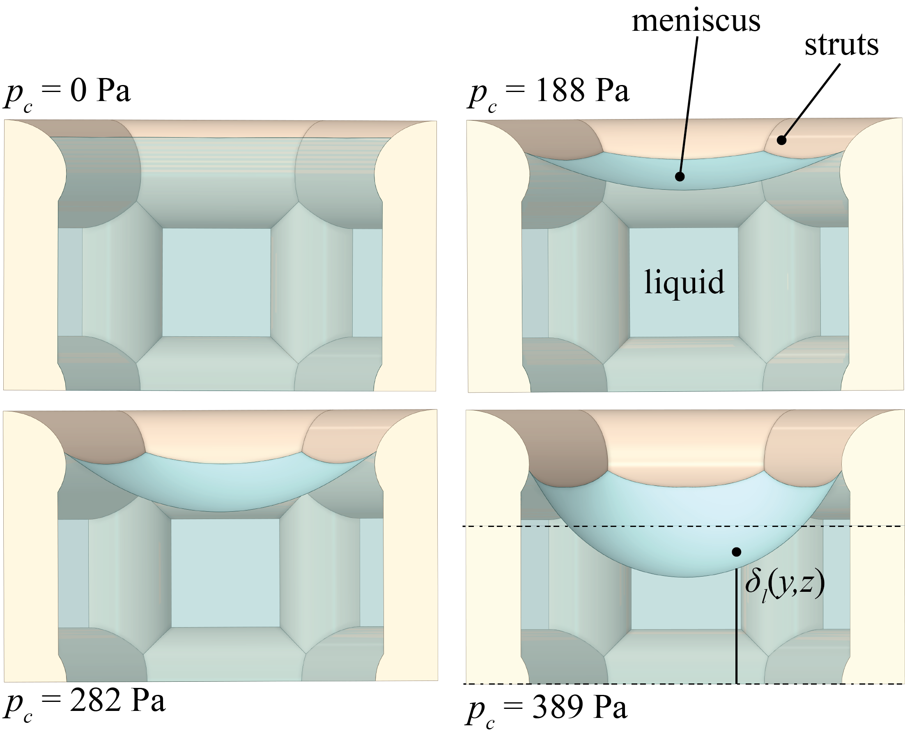

**Surface Evolver codes for capillary wick simulation**

These 3 files were developed for use in the Surface Evolver (SE) (https://kenbrakke.com/evolver/evolver.html) for 3-D numerical simulations of the capillary surface and pressure in evaporating wick structures. 
